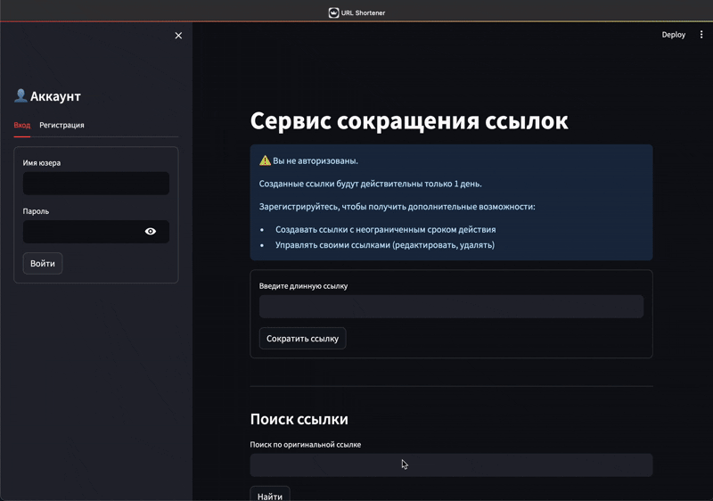
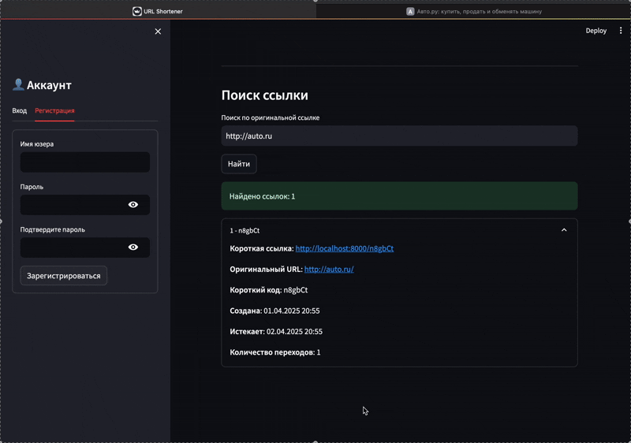
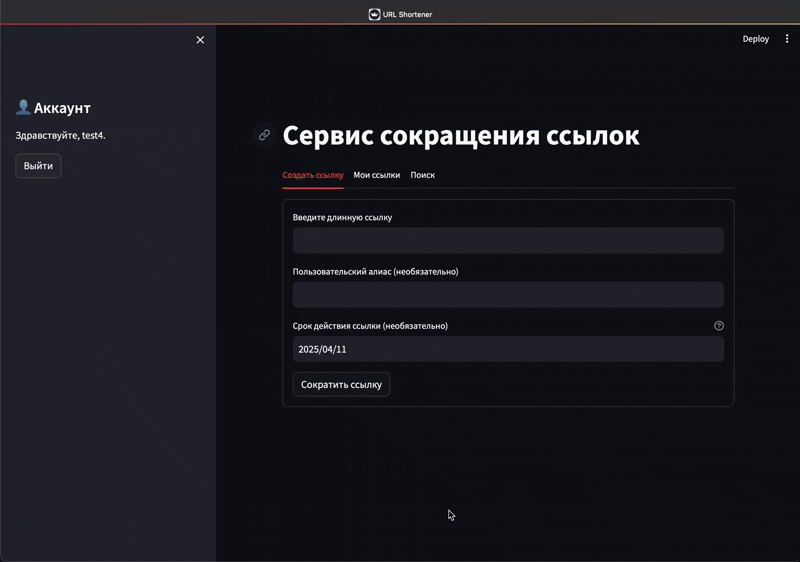
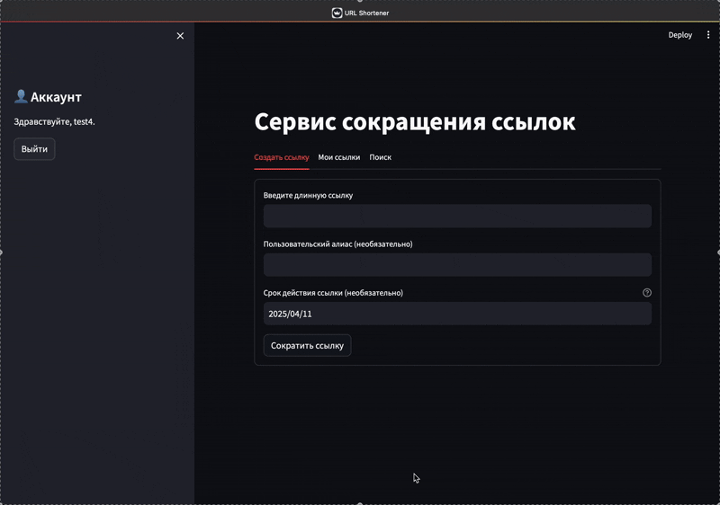
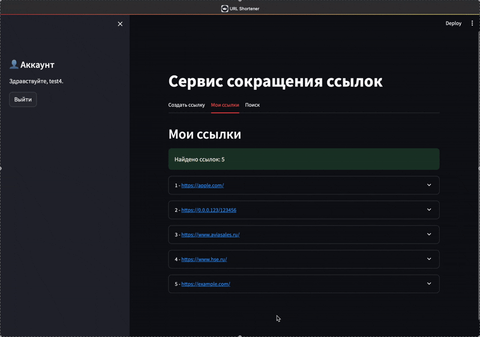
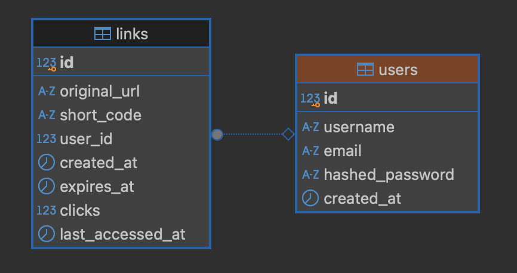
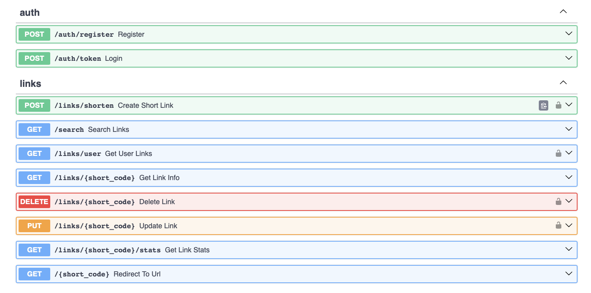

# Applied Python HW 3

Сервис для сокращения URL-ссылок с аналитикой.

## Функциональность

- Создание коротких ссылок
- Статистика переходов
- Управление сроком жизни ссылок
- Поиск по оригинальному URL
- Регистрация/Авторизация юзеров

## Технологии

- FastAPI
- PostgreSQL
- SQLAlchemy
- JWT для авторизации
- Streamlit (фронтенд)
- Docker и Docker Compose для развертывания

## Демонстрация проекта

> [!NOTE]
> Я добавил фронт на Streamlit для удобной и красивой демонстрации функционала. (И получения дополнительных баллов за ДЗ)

### Функционал незарегистрированного пользователя

Он ограничен в отличии от авторизированного юзера.

- Мы можем создать короткую ссылку (но нельзя придумать свой алиас)
- Мы можем пользоваться поиском и статистикой переходов
- Нет возможности регулировать время протухания (ссылка живет 1 день)

### Регистрация и авторизация

Простая регистрация по логину и пассу. Есть проверки на уникальность Апи поддерживает еще обработку email, но на фронт я решил не тащить

> Релизовано с помощью jose(jwt), CookieManager, CryptContext

### Создание ссылок

Все тоже самое что и у неавторизированого юзера + может сам придумать ссылку и задать время протухания

### Обновление ссылок

> [!IMPORTANT]
> Здесь можно увидеть что я не удаляю протухшие линки, а просто помечаю их. При переходе будет 410 (requested resource is no longer available).

Доступно редактирование самой линки, алиаса или срока протухания (даже для уже просроченых)

### Удаление ссылок

### БД на PostgreSQL - просто 2 связанные таблички с юзерами и ликами

## Доступ к приложениям:

- Frontend (Streamlit): http://localhost:8501
- Backend API: http://localhost:8000
- API документация: http://localhost:8000/docs

## API Endpoints

- `POST /links/shorten` - создание короткой ссылки
- `GET /{short_code}` - переход по короткой ссылке
- `GET /links/{short_code}` - информация о ссылке
- `PUT /links/{short_code}` - обновление ссылки
- `DELETE /links/{short_code}` - удаление ссылки
- `GET /links/{short_code}/stats` - статистика по ссылке
- `GET /search` - поиск по оригинальному URL

## AUTH Endpoints

- `POST /auth/register` - регистрация нового пользователя
- `POST /auth/token` - аутентификация и получение токена доступа
